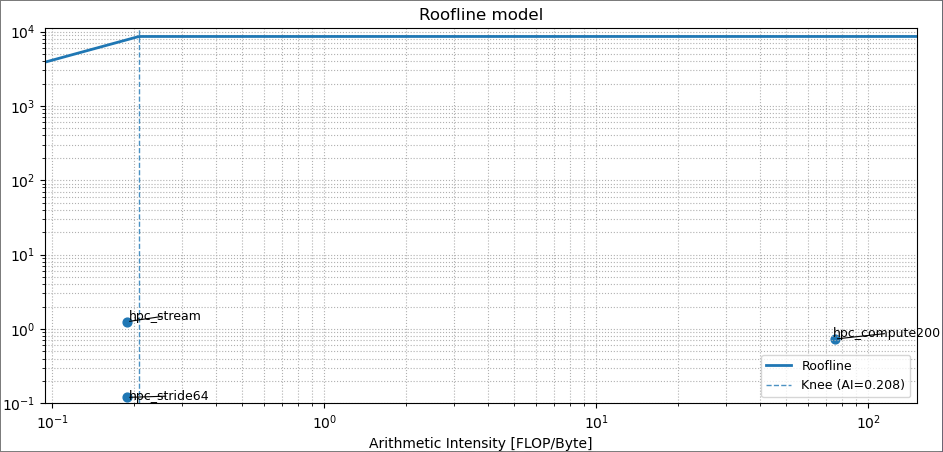

# Lab 02 Report

## likwid-topology

### Nom et type du CPU

CPU name: 11th Gen Intel(R) Core(TM) i7-1165G7 @ 2.80GHz
CPU type: Intel Tigerlake processor

#### Topologie

Sockets: 1

CPU dies: 1

Cores per socket: 4

Threads per core: 2

#### Hiérarchie de la mémoire

Level: 1
Size: 48 kB
Cache groups: ( 0 4 ) ( 1 5 ) ( 2 6 ) ( 3 7 )

Level: 2
Size: 1.25 MB
Cache groups: ( 0 4 ) ( 1 5 ) ( 2 6 ) ( 3 7 )

Level: 3
Size: 12 MB
Cache groups: ( 0 4 1 5 2 6 3 7 )

- maxperf = 8589.26 MFlops/s
- maxband = 41255.31 MB/s

## Cas d'étude

1. [calc stream]   n=50000000  time=0.119929 s  BW~6.67 GB/s  FLOPs~1.25 GF/s  AI~0.188
2. [calc compute]  n=20000000 iters=200  time=33.091355 s  BW~0.01 GB/s  FLOPs~0.73 GF/s  AI~75.250
3. [calc stride]   n=50000000 stride=2  time=0.141450 s  BW~5.66 GB/s  FLOPs~1.06 GF/s  AI~0.188
4. [calc stride]   n=50000000 stride=16  time=0.765484 s  BW~1.05 GB/s  FLOPs~0.20 GF/s  AI~0.188
5. [calc stride]   n=50000000 stride=64  time=1.281072 s  BW~0.62 GB/s  FLOPs~0.12 GF/s  AI~0.188
6. [calc rowmajor] N=4096  time=0.034689 s  readBW~3.87 GB/s
7. [calc colmajor] N=4096  time=0.163066 s  readBW~0.82 GB/s

On observe que le compute prend beaucoup plus de temps que les autres, ce qui est logique car il effectue beaucoup plus de calculs. Le stride avec un stride de 2 est plus rapide que les strides de 16 et 64, ce qui montre que l'accès à la mémoire est plus efficace avec un stride plus petit. Enfin, le rowmajor est beaucoup plus rapide que le colmajor, ce qui indique que l'accès à la mémoire est plus efficace lorsque les données sont organisées en ligne plutôt qu'en colonne.

## Conclusion

On a pu observer que les performances de l'application sont fortement influencées par la manière dont les données sont organisées en mémoire et par la quantité de calculs effectués. Il est important de prendre en compte ces facteurs lors de l'optimisation des applications pour obtenir les meilleures performances possibles.

Pour ça, l'utilisation des optimisations du compilateur peut-être un bon point de départ pour l'amélioration des performances.
